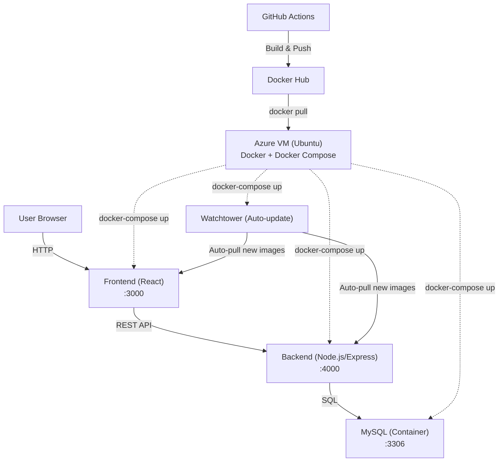

# Full-Stack DevOps Learning Project

This project is a modern, production-ready, full-stack application demonstrating best practices in DevOps, automation, and cloud-native deployment. It features a React frontend, Node.js/Express backend, MySQL database (containerized), and a fully automated CI/CD pipeline with GitHub Actions, Docker Hub, Terraform, and Ansible.

---

## 🚀 Architecture Overview



---

## ✨ Features
- Automated infrastructure provisioning with **Terraform**
- Automated configuration and deployment with **Ansible**
- **CI/CD** with GitHub Actions and Docker Hub
- **Frontend:** React (Dockerized)
- **Backend:** Node.js/Express (Dockerized)
- **Database:** MySQL (Dockerized)
- **Watchtower** for automatic container updates
- Dynamic, robust environment variable and API URL management
- No hardcoded IPs; fully dynamic and production-ready

---

## 🛠️ Tech Stack
- **Frontend:** React, Material UI, Axios
- **Backend:** Node.js, Express, JWT, bcrypt, mysql2
- **Database:** MySQL (container)
- **Infrastructure:** Azure VM (Ubuntu), Docker Compose
- **Automation:** Terraform, Ansible
- **CI/CD:** GitHub Actions, Docker Hub
- **Monitoring/Updates:** Watchtower

---

## ⚡ Deployment Instructions

### 1. Provision Infrastructure
```sh
cd infra
terraform apply
```
- This will create the Azure VM and networking.

### 2. Deploy the App Stack
```sh
cd ansible
ansible-playbook -i ./inventory.sh playbook.yml
```
- This installs Docker, Docker Compose, MySQL client, and deploys the app stack.
- The compose file is dynamically templated with the VM's public IP.

### 3. CI/CD Pipeline
- Any push to `main` triggers GitHub Actions to build and push new Docker images to Docker Hub.
- Watchtower on the VM auto-updates containers when new images are available.

---

## 🌐 Environment Variables

**Backend:**
- `DB_HOST=db`
- `DB_USER=appuser`
- `DB_PASSWORD=apppassword`
- `DB_NAME=appdb`
- `DB_PORT=3306`
- `JWT_SECRET=supersecretkey`
- `FRONTEND_URL=http://<VM_PUBLIC_IP>:3000`
- `PORT=4000`

**Frontend:**
- `REACT_APP_API_URL=http://<VM_PUBLIC_IP>:4000` (injected at runtime)

---

## 🧩 Project Structure
```
backend/         # Node.js/Express API
frontend/        # React app
infra/           # Terraform code
ansible/         # Ansible playbook, inventory, compose template
.github/         # GitHub Actions workflow
system-diagram/  # Architecture diagram (optional)
```

---

## 🤝 Contributing
1. Fork the repo
2. Create a new branch (`git checkout -b feature/your-feature`)
3. Commit your changes (`git commit -am 'Add new feature'`)
4. Push to the branch (`git push origin feature/your-feature`)
5. Open a Pull Request

---

## 📄 License
MIT

---

## 💡 Notes
- For production, consider adding HTTPS, monitoring, and scaling features.
- All secrets and sensitive files are excluded by `.gitignore`.
- For any questions or improvements, open an issue or PR!
