# GitOps Learning - Flask Microservices

This project demonstrates a complete GitOps workflow with Python Flask microservices, featuring:

## Application Architecture

The application is built using Python Flask microservices architecture with the following components:

- **Frontend Service** (Port 8080): Flask web application for user interface
- **User Service** (Port 5001): User management and authentication
- **Product Service** (Port 5002): Product catalog management
- **Order Service** (Port 5003): Order processing and management

Each service has its own MySQL database:
- User DB (Port 32000)
- Product DB (Port 32001) 
- Order DB (Port 32002)

## System Architecture

### Overall System Architecture

```mermaid
flowchart TD
    %% User Layer
    User["👤 User Browser"]
    
    %% Application Layer
    FE["🌐 Frontend (Flask)\n:8080"]
    US["👤 User Service (Flask)\n:5001"]
    PS["📦 Product Service (Flask)\n:5002"]
    OS["🛒 Order Service (Flask)\n:5003"]
    
    %% Database Layer
    UDB["🗄️ User DB (MySQL)\n:32000"]
    PDB["🗄️ Product DB (MySQL)\n:32001"]
    ODB["🗄️ Order DB (MySQL)\n:32002"]
    
    %% Infrastructure Layer
    VM["☁️ AWS EC2 (Ubuntu 22.04)\n🐳 Docker + Docker Compose"]
    WT["🔄 Watchtower (Auto-update)"]
    
    %% CI/CD Pipeline
    GH["📝 GitHub Actions"]
    DH["🐳 Docker Hub"]
    TF["🏗️ Terraform"]
    ANS["⚙️ Ansible"]
    
    %% User Interactions
    User -- "HTTP/HTTPS" --> FE
    FE -- "REST API" --> US
    FE -- "REST API" --> PS
    FE -- "REST API" --> OS
    
    %% Service-Database Connections
    US -- "SQL" --> UDB
    PS -- "SQL" --> PDB
    OS -- "SQL" --> ODB
    
    %% CI/CD Flow
    GH -- "1. Build & Push Images" --> DH
    GH -- "2. Deploy Infrastructure" --> TF
    TF -- "3. Provision EC2" --> VM
    GH -- "4. Deploy Application" --> ANS
    ANS -- "5. Configure & Deploy" --> VM
    
    %% Container Management
    DH -- "docker pull" --> VM
    VM -. "docker-compose up" .-> FE
    VM -. "docker-compose up" .-> US
    VM -. "docker-compose up" .-> PS
    VM -. "docker-compose up" .-> OS
    VM -. "docker-compose up" .-> UDB
    VM -. "docker-compose up" .-> PDB
    VM -. "docker-compose up" .-> ODB
    VM -. "docker-compose up" .-> WT
    
    %% Auto-update Flow
    WT -- "Auto-pull new images" --> FE
    WT -- "Auto-pull new images" --> US
    WT -- "Auto-pull new images" --> PS
    WT -- "Auto-pull new images" --> OS
    
    %% Styling
    classDef userLayer fill:#e1f5fe
    classDef appLayer fill:#f3e5f5
    classDef dbLayer fill:#e8f5e8
    classDef infraLayer fill:#fff3e0
    classDef cicdLayer fill:#fce4ec
    
    class User userLayer
    class FE,US,PS,OS appLayer
    class UDB,PDB,ODB dbLayer
    class VM,WT infraLayer
    class GH,DH,TF,ANS cicdLayer
```



### Deployment Pipeline Architecture

```mermaid
flowchart LR
    %% Development Flow
    Dev["💻 Developer"]
    Git["📚 Git Repository"]
    
    %% CI/CD Stages
    subgraph "🔄 CI/CD Pipeline"
        Build["🏗️ Build Stage"]
        Test["🧪 Test Stage"]
        Deploy["🚀 Deploy Stage"]
        Monitor["📊 Monitor Stage"]
    end
    
    %% Infrastructure
    subgraph "☁️ Cloud Infrastructure"
        TF["🏗️ Terraform\nInfrastructure as Code"]
        EC2["🖥️ AWS EC2 Instance"]
        SG["🔒 Security Groups"]
        VPC["🌐 VPC & Subnets"]
    end
    
    %% Application Deployment
    subgraph "🐳 Application Layer"
        Docker["🐳 Docker Images"]
        Compose["📦 Docker Compose"]
        Services["🔧 Microservices"]
    end
    
    %% Monitoring & Updates
    subgraph "📈 Operations"
        Watchtower["🔄 Watchtower\nAuto-updates"]
        Health["❤️ Health Checks"]
        Logs["📝 Logging"]
    end
    
    %% Flow Connections
    Dev --> Git
    Git --> Build
    Build --> Test
    Test --> Deploy
    
    Deploy --> TF
    TF --> EC2
    TF --> SG
    TF --> VPC
    
    Deploy --> Docker
    Docker --> Compose
    Compose --> Services
    
    Services --> Watchtower
    Services --> Health
    Services --> Logs
    
    %% Styling
    classDef devLayer fill:#e3f2fd
    classDef pipelineLayer fill:#f1f8e9
    classDef infraLayer fill:#fff8e1
    classDef appLayer fill:#fce4ec
    classDef opsLayer fill:#e8f5e8
    
    class Dev,Git devLayer
    class Build,Test,Deploy,Monitor pipelineLayer
    class TF,EC2,SG,VPC infraLayer
    class Docker,Compose,Services appLayer
    class Watchtower,Health,Logs opsLayer
```



### Service Communication Flow

```mermaid
sequenceDiagram
    participant U as 👤 User
    participant F as 🌐 Frontend
    participant US as 👤 User Service
    participant PS as 📦 Product Service
    participant OS as 🛒 Order Service
    participant UDB as 🗄️ User DB
    participant PDB as 🗄️ Product DB
    participant ODB as 🗄️ Order DB
    
    %% User Registration Flow
    U->>F: Register Account
    F->>US: POST /api/users/register
    US->>UDB: INSERT user
    UDB-->>US: User created
    US-->>F: Registration success
    F-->>U: Account created
    
    %% User Login Flow
    U->>F: Login
    F->>US: POST /api/users/login
    US->>UDB: SELECT user
    UDB-->>US: User data
    US-->>F: JWT token
    F-->>U: Logged in
    
    %% Product Browsing Flow
    U->>F: Browse Products
    F->>PS: GET /api/products
    PS->>PDB: SELECT products
    PDB-->>PS: Product list
    PS-->>F: Products data
    F-->>U: Display products
    
    %% Order Creation Flow
    U->>F: Create Order
    F->>OS: POST /api/orders
    OS->>ODB: INSERT order
    ODB-->>OS: Order created
    OS-->>F: Order confirmation
    F-->>U: Order placed
```



### Infrastructure Architecture



```mermaid
graph TB
    %% AWS Cloud
    subgraph "☁️ AWS Cloud (ap-southeast-1)"
        subgraph "🌐 VPC (10.1.0.0/16)"
            subgraph "🏢 Public Subnet (10.1.1.0/24)"
                EC2["🖥️ EC2 Instance\nUbuntu 22.04\nt3.micro"]
            end
            
            subgraph "🔒 Security Groups"
                SG_SSH["🔑 SSH (22)\n0.0.0.0/0"]
                SG_HTTP["🌐 HTTP (80, 443)\n0.0.0.0/0"]
                SG_APP["🔧 App Ports\n8080, 5001-5003\n0.0.0.0/0"]
                SG_DB["🗄️ Database\n32000-32002\n0.0.0.0/0"]
            end
        end
        
        IGW["🌍 Internet Gateway"]
        RT["🛣️ Route Table"]
        EIP["📡 Elastic IP (Optional)"]
    end
    
    %% Docker Containers on EC2
    subgraph "🐳 Docker Containers"
        subgraph "🔧 Application Services"
            FE_Cont["🌐 Frontend\n:8080"]
            US_Cont["👤 User Service\n:5001"]
            PS_Cont["📦 Product Service\n:5002"]
            OS_Cont["🛒 Order Service\n:5003"]
        end
        
        subgraph "🗄️ Database Services"
            UDB_Cont["User DB\n:32000"]
            PDB_Cont["Product DB\n:32001"]
            ODB_Cont["Order DB\n:32002"]
        end
        
        WT_Cont["🔄 Watchtower\nAuto-update"]
    end
    
    %% External Services
    GH["📝 GitHub Actions\nCI/CD Pipeline"]
    DH["🐳 Docker Hub\nImage Registry"]
    
    %% Connections
    IGW --> RT
    RT --> EC2
    EC2 --> SG_SSH
    EC2 --> SG_HTTP
    EC2 --> SG_APP
    EC2 --> SG_DB
    
    EC2 --> FE_Cont
    EC2 --> US_Cont
    EC2 --> PS_Cont
    EC2 --> OS_Cont
    EC2 --> UDB_Cont
    EC2 --> PDB_Cont
    EC2 --> ODB_Cont
    EC2 --> WT_Cont
    
    GH --> DH
    DH --> EC2
    
    %% Styling
    classDef awsLayer fill:#ff9900,stroke:#232f3e,stroke-width:2px,color:#fff
    classDef containerLayer fill:#2496ed,stroke:#fff,stroke-width:2px,color:#fff
    classDef externalLayer fill:#333,stroke:#fff,stroke-width:2px,color:#fff
    
    class IGW,RT,EIP,EC2,SG_SSH,SG_HTTP,SG_APP,SG_DB awsLayer
    class FE_Cont,US_Cont,PS_Cont,OS_Cont,UDB_Cont,PDB_Cont,ODB_Cont,WT_Cont containerLayer
    class GH,DH externalLayer
```

### Microservices Design Pattern

The application follows a **Microservices Architecture** pattern where each service is:
- **Independently deployable**: Each service can be deployed, updated, and scaled independently
- **Loosely coupled**: Services communicate through well-defined APIs
- **Single responsibility**: Each service handles a specific business domain
- **Database per service**: Each service owns its data and database

### DevOps Pipeline Architecture

```mermaid
flowchart TD
    %% Development Phase
    subgraph "💻 Development"
        Code["📝 Code Changes"]
        Git["📚 Git Repository"]
        Branch["🌿 Feature Branch"]
    end
    
    %% CI/CD Pipeline
    subgraph "🔄 CI/CD Pipeline"
        subgraph "🏗️ Build Stage"
            Checkout["📥 Checkout Code"]
            DockerBuild["🐳 Build Docker Images"]
            PushImages["📤 Push to Docker Hub"]
        end
        
        subgraph "🧪 Test Stage"
            UnitTests["🧪 Unit Tests"]
            IntegrationTests["🔗 Integration Tests"]
            SecurityScan["🔒 Security Scan"]
        end
        
        subgraph "🚀 Deploy Stage"
            TerraformPlan["🏗️ Terraform Plan"]
            TerraformApply["☁️ Terraform Apply"]
            AnsibleDeploy["⚙️ Ansible Deployment"]
        end
        
        subgraph "📊 Monitor Stage"
            HealthCheck["❤️ Health Checks"]
            Logging["📝 Logging"]
            Monitoring["📈 Monitoring"]
        end
    end
    
    %% Infrastructure
    subgraph "☁️ Cloud Infrastructure"
        AWS["AWS Cloud"]
        EC2["🖥️ EC2 Instance"]
        VPC["🌐 VPC & Networking"]
        Security["🔒 Security Groups"]
    end
    
    %% Application
    subgraph "🐳 Application Deployment"
        DockerCompose["📦 Docker Compose"]
        Services["🔧 Microservices"]
        Databases["🗄️ Databases"]
        Watchtower["🔄 Auto-updates"]
    end
    
    %% Flow
    Code --> Git
    Git --> Branch
    Branch --> Checkout
    
    Checkout --> DockerBuild
    DockerBuild --> PushImages
    PushImages --> UnitTests
    
    UnitTests --> IntegrationTests
    IntegrationTests --> SecurityScan
    SecurityScan --> TerraformPlan
    
    TerraformPlan --> TerraformApply
    TerraformApply --> AnsibleDeploy
    AnsibleDeploy --> HealthCheck
    
    HealthCheck --> Logging
    Logging --> Monitoring
    
    TerraformApply --> AWS
    AWS --> EC2
    AWS --> VPC
    AWS --> Security
    
    AnsibleDeploy --> DockerCompose
    DockerCompose --> Services
    DockerCompose --> Databases
    DockerCompose --> Watchtower
    
    %% Styling
    classDef devLayer fill:#e3f2fd
    classDef pipelineLayer fill:#f1f8e9
    classDef infraLayer fill:#fff8e1
    classDef appLayer fill:#fce4ec
    
    class Code,Git,Branch devLayer
    class Checkout,DockerBuild,PushImages,UnitTests,IntegrationTests,SecurityScan,TerraformPlan,TerraformApply,AnsibleDeploy,HealthCheck,Logging,Monitoring pipelineLayer
    class AWS,EC2,VPC,Security infraLayer
    class DockerCompose,Services,Databases,Watchtower appLayer
```



### Service Responsibilities

| Service | Port | Database | Responsibilities |
|---------|------|----------|------------------|
| **Frontend** | 8080 | - | User interface, API gateway, session management |
| **User Service** | 5001 | User DB (32000) | Authentication, user management, profile operations |
| **Product Service** | 5002 | Product DB (32001) | Product catalog, inventory, search functionality |
| **Order Service** | 5003 | Order DB (32002) | Order processing, shopping cart, payment integration |

### Data Flow Architecture

#### 1. User Registration Flow
```
Frontend → User Service → User Database
    ↓           ↓              ↓
HTTP POST → Flask Route → MySQL Insert
```

#### 2. Product Browsing Flow
```
Frontend → Product Service → Product Database
    ↓           ↓              ↓
HTTP GET → Flask Route → MySQL Select
```

#### 3. Order Processing Flow
```
Frontend → Order Service → Order Database
    ↓           ↓              ↓
HTTP POST → Flask Route → MySQL Insert
```

### Current Deployment Status

#### 🚀 Staging Environment
- **Status**: Automated deployment via GitHub Actions
- **Trigger**: Push to `staging` branch
- **Infrastructure**: AWS EC2 (t3.micro) in ap-southeast-1
- **Monitoring**: Health checks and logging enabled

#### 📊 Monitoring & Health Checks
- **Frontend**: `http://[SERVER_IP]:8080`
- **User Service**: `http://[SERVER_IP]:5001/api/users`
- **Product Service**: `http://[SERVER_IP]:5002/api/products`
- **Order Service**: `http://[SERVER_IP]:5003/api/orders`

#### 🔧 Deployment Tools
- **Infrastructure**: Terraform (modular approach)
- **Configuration**: Ansible playbooks
- **CI/CD**: GitHub Actions workflows
- **Containerization**: Docker & Docker Compose
- **Auto-updates**: Watchtower for zero-downtime deployments

#### 📈 Key Features
- **GitOps Workflow**: Infrastructure and application as code
- **Microservices**: Independent deployment and scaling
- **Database per Service**: Data isolation and autonomy
- **Security**: AWS security groups, fail2ban, log rotation
- **Monitoring**: Health checks, logging, and auto-recovery

### Service Responsibilities

#### Frontend Service (Port 8080)
- **Purpose**: Single-page application serving the user interface
- **Technologies**: Flask, Jinja2 templates, Bootstrap
- **Features**:
  - User registration and login forms
  - Product catalog display
  - Shopping cart management
  - Order checkout process
  - User profile management

#### User Service (Port 5001)
- **Purpose**: User management and authentication
- **API Endpoints**:
  - `POST /api/user/register` - User registration
  - `POST /api/user/login` - User authentication
  - `GET /api/user/profile` - Get user profile
  - `PUT /api/user/profile` - Update user profile
- **Database Schema**:
  - Users table (id, username, email, password_hash, created_at, updated_at)

#### Product Service (Port 5002)
- **Purpose**: Product catalog management
- **API Endpoints**:
  - `GET /api/product/list` - List all products
  - `GET /api/product/<id>` - Get product details
  - `POST /api/product/create` - Create new product
  - `PUT /api/product/<id>` - Update product
  - `DELETE /api/product/<id>` - Delete product
- **Database Schema**:
  - Products table (id, name, slug, image, price, created_at, updated_at)

#### Order Service (Port 5003)
- **Purpose**: Order processing and management
- **API Endpoints**:
  - `POST /api/order/create` - Create new order
  - `GET /api/order/list` - List user orders
  - `GET /api/order/<id>` - Get order details
  - `PUT /api/order/<id>/status` - Update order status
- **Database Schema**:
  - Orders table (id, user_id, total_amount, status, created_at, updated_at)
  - Order_items table (id, order_id, product_id, quantity, price)

### Infrastructure Architecture

#### Development Environment
```
┌─────────────────────────────────────────────────────────────────────────────┐
│                           Docker Compose Network                            │
│                              (micro_network)                                │
│                                                                             │
│  ┌─────────────┐  ┌─────────────┐  ┌─────────────┐  ┌─────────────┐        │
│  │   Frontend  │  │ User Service│  │Product Svc  │  │Order Service│        │
│  │   (8080)    │  │   (5001)    │  │   (5002)    │  │   (5003)    │        │
│  └─────────────┘  └─────────────┘  └─────────────┘  └─────────────┘        │
│         │                 │                 │                 │            │
│         └─────────────────┼─────────────────┼─────────────────┘            │
│                           │                 │                 │            │
│                    ┌─────────────┐  ┌─────────────┐  ┌─────────────┐        │
│                    │  User DB    │  │ Product DB  │  │  Order DB   │        │
│                    │  (32000)    │  │  (32001)    │  │  (32002)    │        │
│                    └─────────────┘  └─────────────┘  └─────────────┘        │
└─────────────────────────────────────────────────────────────────────────────┘
```

#### Production Environment
```
┌─────────────────────────────────────────────────────────────────────────────┐
│                              Load Balancer                                  │
│                              (Nginx/AWS ALB)                                │
└─────────────────────────────────────────────────────────────────────────────┘
                                    │
                    ┌───────────────┼───────────────┐
                    │               │               │
            ┌─────────────┐ ┌─────────────┐ ┌─────────────┐
            │Frontend Pod │ │User Svc Pod │ │Product Pod  │
            │  (K8s)      │ │  (K8s)      │ │  (K8s)      │
            └─────────────┘ └─────────────┘ └─────────────┘
                    │               │               │
            ┌─────────────┐ ┌─────────────┐ ┌─────────────┐
            │  User DB    │ │ Product DB  │ │  Order DB   │
            │  (RDS)      │ │  (RDS)      │ │  (RDS)      │
            └─────────────┘ └─────────────┘ └─────────────┘
```

### Security Architecture

#### Authentication & Authorization
- **JWT Tokens**: Stateless authentication using JSON Web Tokens
- **Password Hashing**: bcrypt for secure password storage
- **CORS**: Cross-Origin Resource Sharing configuration
- **Input Validation**: Request validation and sanitization

#### Network Security
- **Docker Networks**: Isolated network communication between services
- **Port Mapping**: Controlled exposure of service ports
- **Environment Variables**: Secure configuration management

### Scalability Considerations

#### Horizontal Scaling
- **Stateless Services**: Frontend, User, Product, and Order services can be scaled horizontally
- **Load Balancing**: Multiple instances can be deployed behind a load balancer
- **Database Scaling**: Each service database can be scaled independently

#### Vertical Scaling
- **Resource Allocation**: Docker containers can be configured with specific CPU/memory limits
- **Database Optimization**: Indexing, query optimization, and connection pooling

### Monitoring & Observability

#### Logging
- **Structured Logging**: JSON-formatted logs for easy parsing
- **Centralized Logging**: All service logs can be aggregated
- **Log Levels**: DEBUG, INFO, WARNING, ERROR levels

#### Health Checks
- **Service Health**: `/health` endpoints for each service
- **Database Connectivity**: Connection health monitoring
- **Dependency Checks**: Service dependency validation

### Data Architecture

#### Database Design
- **Database per Service**: Each microservice owns its data
- **ACID Compliance**: Transactional integrity within each service
- **Data Consistency**: Eventual consistency across services

#### Data Flow Patterns
- **Synchronous Communication**: HTTP REST APIs for immediate responses
- **Asynchronous Communication**: Message queues for event-driven communication (future enhancement)
- **Data Replication**: Read replicas for improved performance (production)

## DevOps Infrastructure

### Infrastructure as Code (Terraform)
- **Location**: `infra/`
- **Purpose**: Provision cloud infrastructure (AWS/Azure/GCP)
- **Components**: VMs, networking, security groups, load balancers

### Configuration Management (Ansible)
- **Location**: `ansible/`
- **Purpose**: System configuration and application deployment
- **Components**: Playbooks for server setup, Docker installation, application deployment

### CI/CD Pipeline (GitHub Actions)
- **Location**: `.github/workflows/`
- **Purpose**: Automated testing, building, and deployment
- **Components**: Build Docker images, run tests, deploy to staging/production

## Local Development Setup

### Prerequisites
- Docker and Docker Compose
- Python 3.8+
- Git

### Quick Start

1. **Clone the repository**:
   ```bash
   git clone <repository-url>
   cd gitops-learning
   ```

2. **Create Docker network**:
   ```bash
   docker network create micro_network
   ```

3. **Build and start services**:
   ```bash
   docker-compose up --build
   ```

4. **Initialize databases**:
   ```bash
   # Initialize user service database
   docker exec -it cuser-service flask db init
   docker exec -it cuser-service flask db migrate
   docker exec -it cuser-service flask db upgrade
   
   # Initialize product service database
   docker exec -it cproduct-service flask db init
   docker exec -it cproduct-service flask db migrate
   docker exec -it cproduct-service flask db upgrade
   
   # Initialize order service database
   docker exec -it corder-service flask db init
   docker exec -it corder-service flask db migrate
   docker exec -it corder-service flask db upgrade
   ```

5. **Populate product database**:
   ```bash
   curl -i -d "name=prod1&slug=prod1&image=product1.jpg&price=100" -X POST localhost:5002/api/product/create
   curl -i -d "name=prod2&slug=prod2&image=product2.jpg&price=200" -X POST localhost:5002/api/product/create
   ```

6. **Access the application**:
   - Frontend: http://localhost:8080
   - User API: http://localhost:5001
   - Product API: http://localhost:5002
   - Order API: http://localhost:5003

## Testing the Application

1. **Register a new user**: http://localhost:5000/register
2. **Login**: http://localhost:5000/login
3. **Browse products and add to cart**
4. **Complete checkout process**

## Production Deployment

### Using Terraform + Ansible + GitHub Actions

1. **Infrastructure Provisioning**:
   ```bash
   cd infra
   terraform init
   terraform plan
   terraform apply
   ```

2. **System Configuration**:
   ```bash
   cd ansible
   ansible-playbook -i inventory playbook.yml
   ```

3. **Application Deployment**:
   - Push to main branch triggers GitHub Actions
   - Automated build and deployment to production

## Service Architecture

```
┌─────────────┐    ┌─────────────┐    ┌─────────────┐    ┌─────────────┐
│   Frontend  │    │ User Service│    │Product Svc  │    │Order Service│
│   (8080)    │    │   (5001)    │    │   (5002)    │    │   (5003)    │
└─────────────┘    └─────────────┘    └─────────────┘    └─────────────┘
       │                   │                   │                   │
       └───────────────────┼───────────────────┼───────────────────┘
                           │                   │                   │
                    ┌─────────────┐    ┌─────────────┐    ┌─────────────┐
                    │  User DB    │    │ Product DB  │    │  Order DB   │
                    │  (32000)    │    │  (32001)    │    │  (32002)    │
                    └─────────────┘    └─────────────┘    └─────────────┘
```

## Technology Stack

### Application
- **Python Flask**: Web framework for microservices
- **MySQL**: Database for each service
- **Docker**: Containerization
- **Docker Compose**: Local development orchestration

### DevOps
- **Terraform**: Infrastructure as Code
- **Ansible**: Configuration Management
- **GitHub Actions**: CI/CD Pipeline
- **Docker**: Container orchestration

## Contributing

1. Fork the repository
2. Create a feature branch
3. Make your changes
4. Add tests
5. Submit a pull request

## License

This project is licensed under the MIT License.
