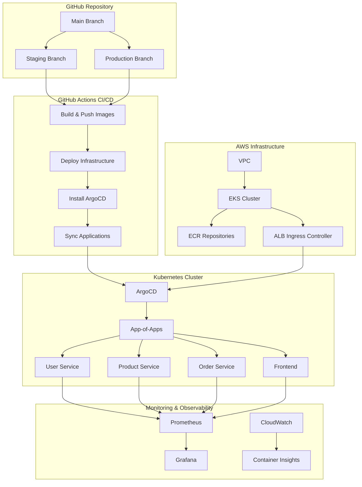
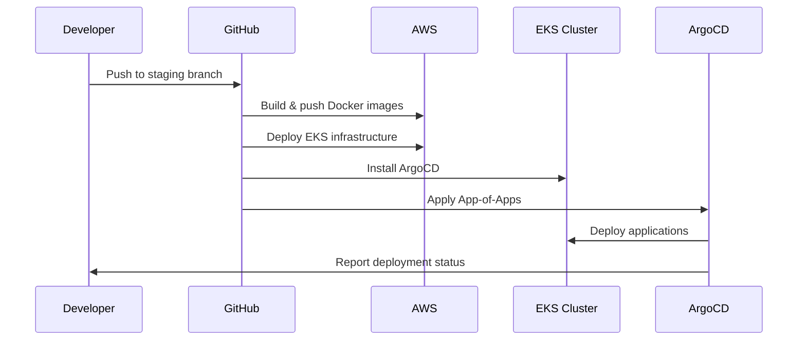

# 🏗️ GitOps Infrastructure Architecture

## 📋 **Overview**

This document describes the production-grade GitOps infrastructure built with EKS, ArgoCD, and automated CI/CD pipelines.

## 🎯 **Architecture Diagram**



## 🔄 **Deployment Flow**



## 🏗️ **Infrastructure Components**

### **1. VPC & Networking**
- **VPC**: 10.0.0.0/16 with public/private subnets
- **NAT Gateway**: Single NAT for cost optimization
- **Security Groups**: EKS-specific rules
- **ALB Ingress Controller**: For external access

### **2. EKS Cluster**
- **Version**: Kubernetes 1.28
- **Node Groups**: t3.micro (Free Tier eligible)
- **IRSA**: For secure AWS access
- **Add-ons**: CoreDNS, kube-proxy, vpc-cni, aws-ebs-csi-driver

### **3. ArgoCD Setup**
- **Installation**: Helm-based with custom values
- **Access**: ALB Ingress with SSL
- **RBAC**: Least privilege access
- **App-of-Apps**: Manages all applications

### **4. Application Architecture**
```
┌─────────────────────────────────────────────────────────────────┐
│                    Application Stack                           │
├─────────────────────────────────────────────────────────────────┤
│  ┌─────────────┐  ┌─────────────┐  ┌─────────────┐          │
│  │   Frontend  │  │User Service │  │Product Svc  │          │
│  │   (React)   │  │  (Flask)    │  │  (Flask)    │          │
│  └─────────────┘  └─────────────┘  └─────────────┘          │
│         │                │                │                   │
│         └────────────────┼────────────────┘                   │
│                          │                                    │
│  ┌─────────────┐  ┌─────────────┐  ┌─────────────┐          │
│  │Order Service│  │   MySQL     │  │   Redis     │          │
│  │  (Flask)    │  │  Database   │  │   Cache     │          │
│  └─────────────┘  └─────────────┘  └─────────────┘          │
└─────────────────────────────────────────────────────────────────┘
```

## 🔐 **Security Architecture**

### **1. Authentication & Authorization**
- **OIDC**: GitHub Actions to AWS
- **IRSA**: Pod identity for AWS services
- **RBAC**: Kubernetes role-based access
- **Network Policies**: Pod-to-pod communication

### **2. Secrets Management**
- **External Secrets Operator**: Syncs from AWS Secrets Manager
- **Sealed Secrets**: For Git-stored secrets
- **Vault**: Optional for advanced secrets

### **3. Network Security**
- **Private Subnets**: Application pods
- **Public Subnets**: ALB only
- **Security Groups**: Minimal required access
- **WAF**: Web Application Firewall

## 📊 **Monitoring & Observability**

### **1. Metrics Collection**
- **Prometheus**: Cluster metrics
- **Grafana**: Visualization
- **CloudWatch**: AWS service metrics
- **Container Insights**: EKS-specific metrics

### **2. Logging**
- **Fluent Bit**: Log collection
- **CloudWatch Logs**: Centralized logging
- **ELK Stack**: Optional advanced logging

### **3. Alerting**
- **Prometheus Alertmanager**: Kubernetes alerts
- **CloudWatch Alarms**: AWS service alerts
- **PagerDuty**: Incident management

## 🚀 **CI/CD Pipeline**

### **1. GitHub Actions Workflow**
```yaml
Jobs:
  1. aws-account: Get AWS account ID
  2. build-and-push: Build & push Docker images
  3. deploy-infrastructure: Terraform apply
  4. sync-argocd: Trigger ArgoCD sync
  5. health-check: Verify deployment
```

### **2. Security Features**
- **OIDC**: No static AWS keys
- **Branch Protection**: Required reviews
- **Automated Testing**: Unit & integration tests
- **Security Scanning**: Container & code scanning

## 💰 **Cost Optimization**

### **1. Resource Sizing**
- **Staging**: t3.micro nodes (Free Tier)
- **Production**: t3.small/medium nodes
- **Auto Scaling**: Based on CPU/memory usage

### **2. Storage Optimization**
- **EBS**: gp3 volumes for better performance
- **ECR Lifecycle**: Keep last 5 images
- **S3**: Intelligent tiering for logs

### **3. Network Optimization**
- **Single AZ**: For staging (cost)
- **Multi-AZ**: For production (availability)
- **NAT Gateway**: Single instance for staging

## 🔧 **Operational Procedures**

### **1. Deployment Process**
1. **Code Push**: Developer pushes to staging/production
2. **CI/CD**: GitHub Actions builds and tests
3. **Infrastructure**: Terraform applies changes
4. **Application**: ArgoCD syncs applications
5. **Verification**: Health checks confirm deployment

### **2. Rollback Process**
1. **Git Revert**: Revert to previous commit
2. **ArgoCD Sync**: Automatic rollback
3. **Verification**: Health checks confirm rollback

### **3. Scaling Process**
1. **Horizontal**: Add more replicas
2. **Vertical**: Increase node size
3. **Auto Scaling**: Based on metrics

## 🛠️ **Troubleshooting**

### **1. Common Issues**
- **Pod Startup**: Check resource limits
- **Network**: Verify security groups
- **Storage**: Check EBS volumes
- **Authentication**: Verify IRSA setup

### **2. Debugging Commands**
```bash
# Check pod status
kubectl get pods --all-namespaces

# Check ArgoCD applications
argocd app list

# Check EKS cluster
aws eks describe-cluster --name staging-cluster

# Check Terraform state
terraform state list
```

## 📈 **Performance Metrics**

### **1. Key Performance Indicators**
- **Deployment Time**: < 5 minutes
- **Rollback Time**: < 2 minutes
- **Uptime**: 99.9% availability
- **Response Time**: < 200ms average

### **2. Resource Utilization**
- **CPU**: 60-80% average
- **Memory**: 70-85% average
- **Storage**: 50-70% average
- **Network**: 40-60% average

## 🔮 **Future Enhancements**

### **1. Advanced Features**
- **Service Mesh**: Istio for microservices
- **Multi-Cluster**: Multiple EKS clusters
- **Disaster Recovery**: Cross-region backup
- **Advanced Monitoring**: Distributed tracing

### **2. Security Enhancements**
- **Pod Security Standards**: Restricted mode
- **Network Policies**: Zero-trust networking
- **Vulnerability Scanning**: Automated security checks
- **Compliance**: SOC2, PCI-DSS compliance

---

## 📚 **Additional Resources**

- [EKS Best Practices](https://aws.amazon.com/eks/resources/best-practices/)
- [ArgoCD Documentation](https://argo-cd.readthedocs.io/)
- [Terraform AWS Provider](https://registry.terraform.io/providers/hashicorp/aws/latest/docs)
- [GitOps Best Practices](https://www.gitops.tech/) 